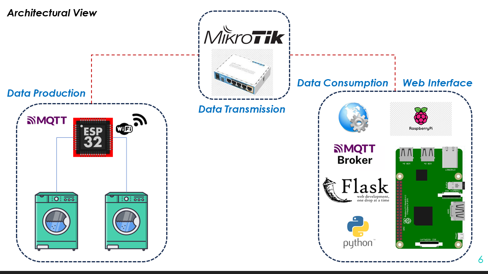
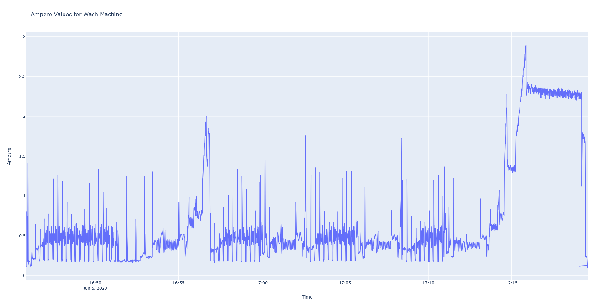

# Smart and Sustainable Wash Machines Monitoring App
**_A project from students to students_**

[](https://www.aegean.gr/)

Wash Machines Monitoring Service is an end-to-end full stack project providing web interface for wash machines live state monitoring for the optimal students time management. This project have been implemented by alumni and students of University of the Aegean to the students of this university and it is placed in the Samos island, in the students reside building.

## All-in-One
Our concept utilizes an eco-friendly approach due to the fact that esp32 is an ultra-low IoT power device opening the horizon for sustainability and low-cost solutions.
- Eco-friendly approach
-         Promoting sustainability both in terms of technological equipment as well as in wash machines longer lifecycle through predictive analysis
-         Open-source project for everyone! - **Always there is space for improvement!**
- Low-cost solution
- Scalable - **With just more Ampere Sensors, you have the desired results**
- Upgradable - **Any part can be upgraded**
- Agnostic-vendor - **It can play in any environment and in any wash machine vendor**


## Hardware, Software and Protocols
This project, combines concepts and technologies from physical layer such ar esp32, software layers such as Python, CSS and middle layer such as mosquitto protocol. Hardware, software and protocols are merged up together to create a web service in which the live state of the wach machines is being displayed. It is a 4-tier architecture.Specifically, our project includes these technologies per layer:

[](https://skillicons.dev)

- Hardware: ESP 32 board, Raspberry Pi 3 Model B+, Current sensors x 2
- Software: Python 3.10, CSS, HTML, JavaScript, CPP firmware
- Middleware: Mosquito Broker, MQTT
- Web Layer: Flask-MQTT


## Application Architecture


### 1-Tier (Data Producer)
ESP32-MCU act as a data producer. With the presence of the 030 A Current Sensors, it can sense in real-time the electric current from the 2 wash machines. Then, with the MQTT protocol, it sends this information to the MQTT Broker (raspberry Pi 3) to the specific topics.

### 2-Tier (Broker)
Raspberry Pi 3 act as a MQTT Broker. It contains the 2 topics. Mosquitto service is active here.

### 3-Tier (Data Consumer)
In the same physical Raspberry Pi 3 there is a Python service runss which act as a MQTT Subscriber to these topics in order to implement a control logic regarding the wash machines states.

### 4-Tier (Web Service)
In the same Raspberry, the Python service also has double role, thus offering a web service (Flask) accessible via the users browser.

### Front-End (Client-Side)
The Front-End running in the browser side, implements also the control logic, by subscibing to the MQTT topics acting also as a MQTT consumer. Therefore, Back-End is not actually needed except a single GET API in the context of page refreshing.

## Function (time) = Ampere
In the context of a single cycle wash, ampere values follow this polynomial function



# App Execution

## Before Installation
*Please, before install all the necesseray libs and scripts, make sure that you have
the right hardware connected and that you are ready to start!*

- You better check these:

| Tools | Description |
| ---- | -------------------------------------------|
| [ESP32 MCU](http://esp32.net/) | Cpp firmware execution, data producing|
| [Raspberry Pi 3 Model B+](https://www.raspberrypi.com/products/raspberry-pi-3-model-b-plus/) | Running Rasbian OS, mosquitto broker service, MongoDB, Python App execution|
| [SCT-013-030 Non-invasive AC Current Sensor](https://www.cableworks.gr/ilektronika/arduino-and-microcontrollers/mcu-and-components/current-voltage/30a-sct-013-030-non-invasive-ac-current-sensor-for-arduino//) | Sensing Wach machines electric current|
    
## Application Installation & Execution
Guidelines in case somebody wants to create this project and develop it in a real environment.
Want to contribute? Great!
### Phase A: Prepare App Environment
```sh
    [ESP32]
    1. Put the wash machines electric cables into AC Sensors
    2. Power on the ESP32
    3. Flash CPP firmware code to ESP32 board
    --------------------------------------
    [RASBPERRY PI]
    1. Power on Pi and connect to it (eg, SSH) 
    2. Install mosquitto lib, MongoDB
    3. Make mosquitto service to autorestart on every system boot (eg, in case of power failure).
        - Rasbian:  $ sudo systemctl enable --now mosquitto.service
```

### Phase B: Install Python Libraries - Execute Python App
    There are 2 scripts for windows (.bat) and Linux (.sh) respectively, that offers installation automation. Only thing that is needed is running one of these scripts. Navigate to python project and: 
```sh
1. ./setup_python_project_linux.sh (first, run this: $ chmod +x setup_python_project_linux.sh)
2. ./setup_python_project_linux.bat
```
*At the end of these scripts, the main.py will be executed!*

### Phase C: Make Python Service a system service
```sh
    1. cd /etc/systemd/system/
    2. sudo nano wash_app.service
```


Using nano,

```python
[Unit]
Description=My Python Project
After=network.target

[Service]
ExecStart=/usr/bin/python3 /path/to/main.py
WorkingDirectory=/path/to/project_directory
Restart=always

[Install]
WantedBy=multi-user.target
```

Make sure to replace /path/to/main.py with the actual path to your main.py file and /path/to/project_directory with the actual path to your project directory. Save the file and exit the nano editor (Ctrl+O, Enter, Ctrl+X).

```sh
    3. sudo systemctl daemon-reload
    4. sudo systemctl enable wash_app
    5. sudo systemctl start wash_app
```

## People
Nikos Rekkas, Vasilis Kartitzoglou and Stefanos Plastras, alumni from University of the Aegean, were involved in the design, implementaion, testing and installation of this project.

### Nikos Rekkas
- Currently, he is working as software engineer in the private sector. He holds a MEng from the Department of Information and Communication Systems Engineering of University of the Aegean.  
Email: nrekkas@gmail.com  
Github: [nikosrk](https://github.com/nikosrk)  

### Stefanos Plastras
- Currently, he is doing his PhD studies in wireless networks. He holds a MEng from Dept. of Information and Communication Systems Engineering and a MSc from Athens University of Economics & Business.  
Email: s.plastras@gmail.com   
Github: [stevpla](https://github.com/stevpla)


## License
The MIT License (MIT)

Copyright (c) 2023 Stefanos Plastras

Permission is hereby granted, free of charge, to any person obtaining a copy of this software and associated documentation files (the "Software"), to deal in the Software without restriction, including without limitation the rights to use, copy, modify, merge, publish, distribute, sublicense, and/or sell copies of the Software, and to permit persons to whom the Software is furnished to do so, subject to the following conditions:

The above copyright notice and this permission notice shall be included in all copies or substantial portions of the Software.

THE SOFTWARE IS PROVIDED "AS IS", WITHOUT WARRANTY OF ANY KIND, EXPRESS OR IMPLIED, INCLUDING BUT NOT LIMITED TO THE WARRANTIES OF MERCHANTABILITY, FITNESS FOR A PARTICULAR PURPOSE AND NONINFRINGEMENT. IN NO EVENT SHALL THE AUTHORS OR COPYRIGHT HOLDERS BE LIABLE FOR ANY CLAIM, DAMAGES OR OTHER LIABILITY, WHETHER IN AN ACTION OF CONTRACT, TORT OR OTHERWISE, ARISING FROM, OUT OF OR IN CONNECTION WITH THE SOFTWARE OR THE USE OR OTHER DEALINGS IN THE SOFTWARE.
